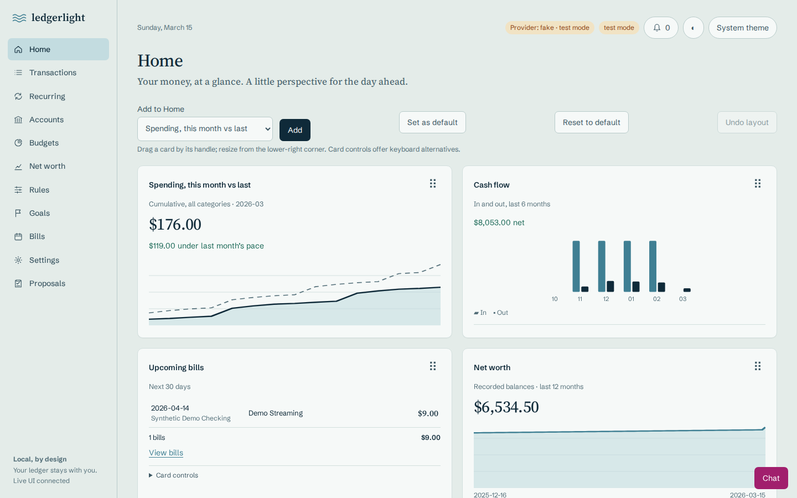
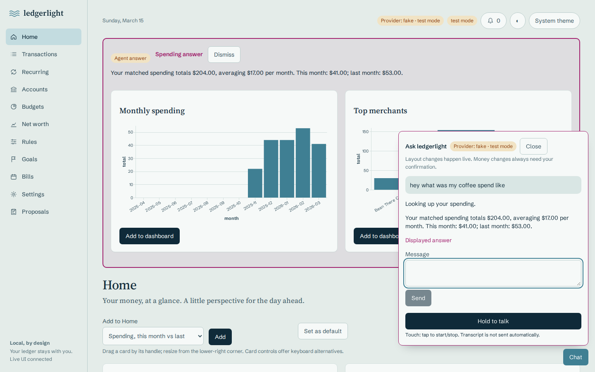
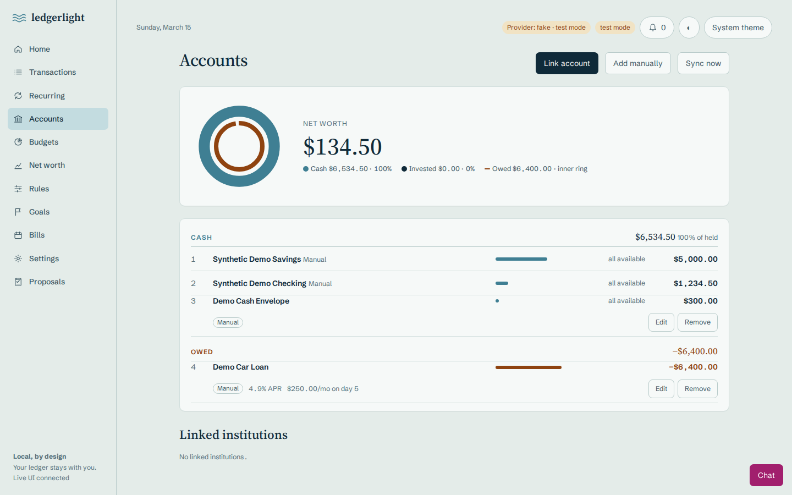
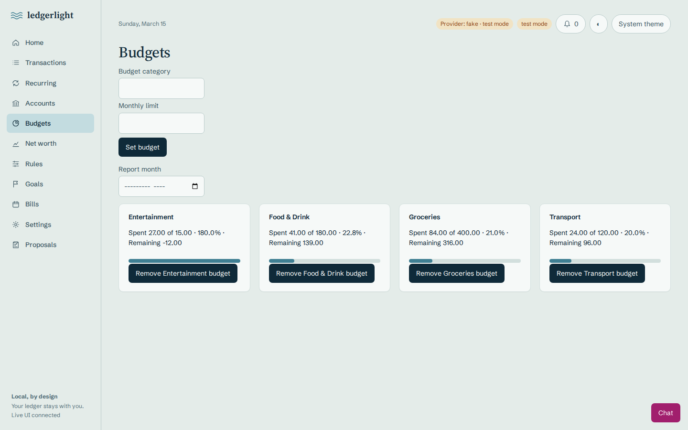
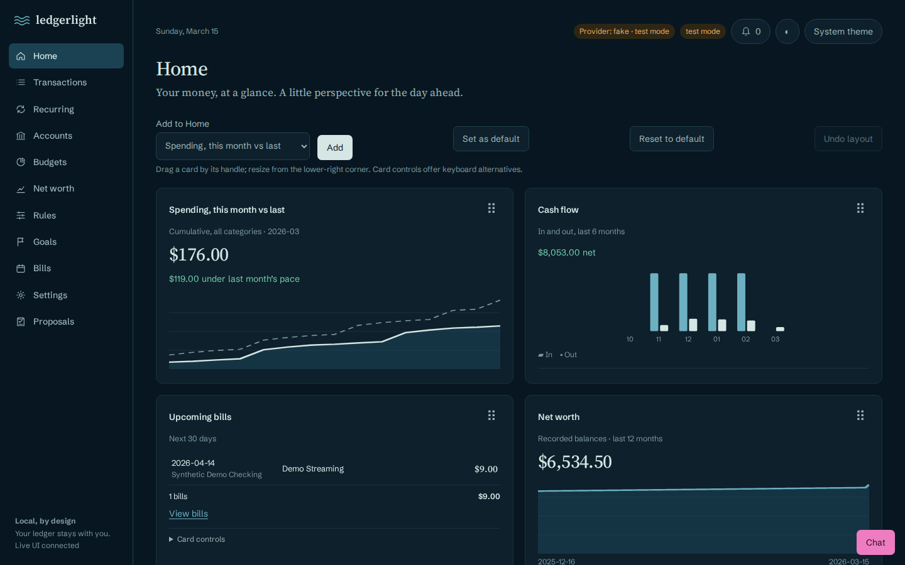

# ledgerlight



Free, self-hosted personal finance with an agent-native CLI. This is a runnable
**v1 stage 8**: Plaid linking/sync, transactions, recurring streams, daily balance
snapshots and net worth, budgets, merchant rules, in-app alerts, notes/tags/splits,
savings goals, plus read-only SQL/Vega-Lite saved charts. The CLI, API
and responsive React app share the same local data layer. The Tide Table UI has
light/dark themes, a draggable versioned dashboard, live CLI control over SSE,
and Undo receipts. A streaming AG-UI chat drawer can drive the UI, preview charts
and propose financial changes for explicit confirmation. Optional push-to-talk
fills the message input without sending it.
Licensed under the MIT License; see LICENSE and THIRD_PARTY_NOTICES.md.

## Use with Claude Code

This repo is also a Claude Code plugin marketplace. In Claude Code, run:

```text
/plugin marketplace add aidanrausch4231/ledgerlight
/plugin install ledgerlight@ledgerlight
```

You get the ledgerlight MCP server (read tools, live UI and dashboard tools, and
confirm-first proposal tools; see **MCP: external agents and inline charts**) and
the `ledgerlight` skill, which drives the CLI. The plugin starts the server with
`uvx --from git+https://github.com/aidanrausch4231/ledgerlight ledgerlight mcp`,
so you need only [uv](https://docs.astral.sh/uv/), not a local install. Restart
Claude Code after installing. Demo data needs no credentials (`ledgerlight demo seed`;
use a separate data directory as shown in **Setup and try it**); Plaid keys are
needed only for real bank linking. For the web UI and confirmation links, run
`ledgerlight serve` from a built checkout (see **Setup and try it**). The plugin skill is a copy of
`src/ledgerlight/SKILL.md`; `tests/test_plugin.py` fails if they differ.

## Ask a question and keep your Home layout



Ask chat “hey what was my coffee spend like” and press Enter (Shift+Enter for a
newline). The agent is instructed to call `spending ask` once, then show an Answer
panel with real totals, a monthly chart and top merchants. No-match answers offer
nearby categories/merchants instead. **Add to dashboard** saves that chart and
pins a card; **Dismiss** removes the panel. A new answer replaces the old one.
Charts follow light/dark Tide Table colors. Real model compliance is not guaranteed;
the two-call flow is covered with the offline scripted provider.

Home's **Set as default** saves the current layout; **Reset to default** restores
it as an undoable version with an Undo chip. Without a saved default, Reset uses
the built-in nine cards. Empty defaults are supported; first-run seeding is unchanged.
CLI/MCP/Agent receipts identify their actual source and clear on user navigation.

```sh
ledgerlight --json spending ask 'hey what was my coffee spend like' --months 12
ledgerlight --json dashboard default save
ledgerlight --json dashboard default show
ledgerlight --json dashboard default reset
ledgerlight --json dashboard undo
```

Spending matching is Unicode case-insensitive over merchant/name/category/tags/notes,
with a small coffee synonym list and conversational filler removal. It excludes
hidden, pending and future transactions and counts only expense split parts.
Months is 1–120, including this month; averages include zero months. Ready specs
carry live read-only SQL for their original date window. No FX normalization.
API mirrors: GET `/api/spending/ask?text=coffee&months=12`,
GET `/api/dashboard/default/show`, POST `/api/dashboard/default/save|reset`.
MCP adds read tool `spending_ask` and layout tool `dashboard_reset_default`.
See packaged `src/ledgerlight/SKILL.md` for complete shapes and edge semantics.

## Accounts overview



Accounts shows a cash/invested ring with an inner owed arc, signed net worth,
and a ranked ledger grouped by Investments, Cash and Owed. Asset groups sort by
total; Owed stays last. All bars share one balance scale; zero/unused accounts
appear in the footer. Credit/loan balances display negative; credit cards show
remaining limit when supplied by Plaid. Names are cleaned on import and once for
existing accounts. Phone and dark layouts use the same Tide Table tokens.

`ledgerlight --json accounts overview`, GET `/api/accounts/overview`, and the
read-only MCP `accounts_overview` tool share this model. The agent's CLI allowlist
also permits it. `accounts list` and GET `/api/accounts` retain their original
balance sign and add nullable `credit_limit`; net-worth history math is unchanged.
Totals are illustrative across currencies, with no FX conversion.
Home's card selector is now labeled **Add to Home**, with an **Add** button.

## Manual accounts and holdings

Use **Add manually** on Accounts for accounts Plaid does not cover: student,
auto and personal loans (amount owed, optional APR %, monthly payment, payment
day 1–28 and auto paydown), cash, other assets, crypto by symbol (for example
BTC 5) and stocks by ticker. Crypto resolves to the highest market-cap CoinGecko
coin for that symbol and shows the coin before you save; set a CoinGecko id to
pick another. They appear in the Crypto, Investments, Cash, Other assets and
Owed groups, in net worth and in daily snapshots. Rows have inline Edit/Remove.

```bash
uv run ledgerlight --json manual add --kind student_loan --name "Student loan" \
  --balance 12000 --apr 5.5 --payment 200 --payment-day 15 --auto-paydown
uv run ledgerlight --json holdings add crypto BTC 0.5
uv run ledgerlight --json holdings add stock AAPL 10
uv run ledgerlight --json holdings refresh   # also applies due loan paydowns
```

Prices come from the CoinGecko free public API and Yahoo's chart endpoint (no keys).
Only coin ids, symbols and tickers leave the machine — never quantities,
balances or names. `serve` refreshes prices every 15 minutes while holdings
exist; on a source error the last price stays and the row shows a warning.
Auto paydown applies each missed monthly payment (owed × (1 + APR/12) −
payment, floored at 0) on refresh, `snapshot`, the server loop or
`manual apply-paydown`. `LEDGERLIGHT_FAKE_PRICES=1` is test-only.

### Loans paid from real transactions

Instead of auto paydown, a manual loan can follow the real payments that leave
your linked accounts. Set **Pays down from transactions matching** (Edit form)
or `--payment-match`: every posted outflow in a linked account whose name or
merchant contains that text (case-insensitive), dated on/after **Matching
since** (default: the day you set it), is deducted from the amount owed exactly
once, after each sync. The balance never goes below 0. If Plaid later removes an
applied transaction, sync adds the amount back. A transaction pays only one
loan: the longest match text wins, a tie goes to the oldest loan, and a loan
already paid off is skipped while another matching loan still owes. After a
relink (or a duplicate link) the same payment, same date, amount and name from
another account, is not deducted again. A loan uses
auto paydown or matching, not both. The row shows e.g. "Auto-matched: 2
payments, last $300 on Oct 21".

```bash
uv run ledgerlight --json manual add --kind personal_loan --name "Sample plan" \
  --balance 1200 --payment-match "ACME PAYLATER"
uv run ledgerlight --json manual payments manual-<id>   # applied payments
uv run ledgerlight --json manual apply-payments         # also runs after sync
uv run ledgerlight --json manual update manual-<id> --payment-match ""  # stop
```

## Prerequisites

- Python 3.12+, [uv](https://docs.astral.sh/uv/)
- Node.js 22.12+ (22 LTS recommended), pnpm 12.4.2
- Linux/macOS for private key file permissions

No credentials are needed for demo data or offline tests. For bank linking, **get your own free Plaid Trial keys** from the Plaid dashboard (Trial:
10 Items). Start with Sandbox for testing. Each user supplies their own Plaid
and optional LLM credentials. Configure settings through environment variables
as described under **Linking and syncing**; the application does not automatically
load `.env`. Never commit credentials,
local databases, or encryption keys. No production Plaid calls are part of the
local test gate; all default tests use deterministic fakes.

## Setup and try it

```sh
uv sync --locked
uv run ledgerlight version
uv run ledgerlight demo seed
uv run ledgerlight --json chart add --title "Spend by category" --type bar \
  --sql "SELECT category, SUM(-amount) AS spend FROM transactions WHERE amount < 0 GROUP BY category"
uv run ledgerlight --json chart list
cd web
pnpm install --frozen-lockfile
pnpm build
cd ..
uv run ledgerlight serve
```

Open http://127.0.0.1:8000. Build the frontend **before** starting the server;
FastAPI serves `web/dist` when it exists in this source checkout. Without a build,
the API still works. Seed adds two synthetic accounts and maintains 124 transactions
across the last 120 days (including coffee shops). Stable IDs reuse prior-stage
demo transactions; later seeds refresh only their dates, without accumulating
transactions or changing amounts, categories, notes, tags, splits or hidden flags.
Unrelated transactions are untouched; no rows are deleted.
Expenses are negative and income is positive. Demo balances are illustrative,
not reconstructed from transactions. Demo also includes synthetic recurring
income/spending and 90 days of snapshots ending today. Use separate data
directories for demos.

```sh
export LEDGERLIGHT_DATA_DIR="$(mktemp -d)"
export LEDGERLIGHT_CONFIG_DIR="$LEDGERLIGHT_DATA_DIR/config"
uv run ledgerlight demo seed
```

The database defaults to `~/.local/share/ledgerlight/ledgerlight.db`.
The Fernet key is generated on first encryption at `~/.config/ledgerlight/key`
(mode 0600, containing directory 0700). Override directories with
`LEDGERLIGHT_DATA_DIR` and `LEDGERLIGHT_CONFIG_DIR`. Back up the key securely with
the database: losing it makes encrypted tokens unrecoverable. SQLite itself is
not encrypted. Linked Plaid access tokens are encrypted before storage; item
lists and sync errors never expose them. Schema upgrades are additive and
idempotent, preserving existing scaffold rows. First connections serialize schema
creation and upgrades in one SQLite `BEGIN IMMEDIATE` transaction, with a
30-second busy timeout for concurrent CLI/server access. `PRAGMA user_version`
skips migration work on current databases; legacy account-name cleanup commits
once with the credit-limit addition. Failed upgrades roll back and retry on the
next connection.

## Development and checks

```sh
uv run ledgerlight serve          # terminal 1, API on 127.0.0.1:8000
cd web && pnpm dev                # terminal 2, loopback Vite with /api proxy
```

```sh
bash scripts/check.sh
# optional frontend lint: cd web && pnpm lint
# if Chromium is not installed: cd web && pnpm e2e:install
```

The gate runs locked Python install, Ruff, pytest, frozen web install, build and
Playwright against the built app. With an isolated HOME lacking a browser cache,
the gate falls back to the browser cache named by `LEDGERLIGHT_PLAYWRIGHT_CACHE`
when set and present; an explicit `PLAYWRIGHT_BROWSERS_PATH` always takes precedence.
Elsewhere, install Chromium with `pnpm e2e:install` as shown above.
Browser storage is temporary, server ports are
allocated dynamically, and the default suite uses the fake without external
browser requests. Playwright retains traces on failure; CI uploads `web/test-results`
and `web/playwright-report` (if produced) for seven days when the e2e job fails.
Inspect a downloaded trace with `cd web && pnpm exec playwright show-trace PATH`.
Traces include DOM/network data; share only synthetic runs and treat live Sandbox
traces as sensitive.
Regenerate README screenshots (synthetic demo data, temporary storage) after
`pnpm build` with `node scripts/screenshots.mjs`.

The saved-provider regression has a 120-second budget, including up to 60 seconds
for its separate cold server to become healthy. It holds real status responses
while the user changes the next selection, then checks both Settings and the
header before saving and reloading. Stress it after building with:

```sh
cd web && pnpm exec playwright test e2e/agent.spec.ts -g "saved provider" --repeat-each=10
```

Live Sandbox is skipped unless explicitly requested:

```sh
# Export your Sandbox PLAID_CLIENT_ID and PLAID_SECRET securely first.
cd web
LEDGERLIGHT_E2E_PLAID=sandbox pnpm e2e
```

The live spec creates a Sandbox public token through the client module for
`ins_109508`, using the same temporary data/config directories as the server
(required `LEDGERLIGHT_E2E_STORAGE`), exchanges through the API, and polls sync for up to ten minutes
until transactions/recurring streams appear and `HISTORICAL_UPDATE_COMPLETE`
arrives. It reports the oldest imported Sandbox date. It does not drive Plaid's iframe. Sandbox recurring
availability depends on Plaid/product access; live testing is separate from the
offline gate. All pytest storage is temporary. CI also runs gitleaks on full
history. Build artifacts, databases, `.env` and keys are ignored.

## CLI and API

Put `--json` before any command for machine-readable errors and results. See the
bundled [CLI skill](src/ledgerlight/SKILL.md) for every command and output shape.
Agents must use the CLI or explicit MCP tools, not SQL connections or the HTTP
API directly.

```sh
uv run ledgerlight --json chart show 1
uv run ledgerlight --json chart remove 1
curl http://127.0.0.1:8000/api/health
curl http://127.0.0.1:8000/api/charts
```

The server binds **only** `127.0.0.1`. For remote use:

```sh
ssh -L 8000:127.0.0.1:8000 user@host
```

Then open http://127.0.0.1:8000 locally. There is no authentication or public
hosting support; never expose the API via a public reverse proxy. Chart queries
are one SELECT statement, executed on a read-only connection; writes, ATTACH
and PRAGMA are rejected. Queries are not resource-budgeted yet: use trusted,
bounded queries on this single-user local scaffold.

## Linking and syncing

Set `PLAID_CLIENT_ID`, `PLAID_SECRET`, and `PLAID_ENV` in the process environment
(no `.env` loading). `PLAID_ENV` defaults to `sandbox`; use `production` only
when intentionally connecting real institutions with your own Trial keys.
Build and start the server, open **Accounts → Link account**, then **Continue
to Plaid** to complete Link. **First link imports the last 12 months** (365 days);
big banks may take a few minutes. Exchange immediately imports all available pages.
Accounts shows “Importing your last 12 months…” with the transaction count and
oldest date so far. Completed imports show “Full year imported” only when the
oldest date is within 14 days of (or earlier than) link date minus requested depth.
Shorter history instead says “History from … — <institution> sent less than the
12 months requested”; custom depths use their day count. Missing dates never
claim a full import. This is a date-span heuristic, not proof of completeness
or transactions on every date. Accounts polls status every two
seconds; the server retries incomplete Items every 60 seconds for at most 30
minutes from linking, stopping on shutdown. Restarting does not extend that window.
After automatic retries pause, **Sync now** or CLI waiting can check again.
Item cards also show last successful sync and safe errors. Recurring data requires
Plaid recurring-product access; a recurring failure rolls back that item's sync.

Optional user setting: `ledgerlight --json settings set history_days 365`.
The API also accepts POST `/api/settings` with
`{"key":"history_days","value":365}` (an integer or integer string).
`LEDGERLIGHT_HISTORY_DAYS` overrides the saved setting; default 365, integer range
30–730, invalid values are errors. Choose the depth before starting Link. Both
normal Link and Sandbox token creation send `transactions.days_requested`.
Depth is captured once when each token is created and retained locally by token
hash. Changing settings while Link is open does not change that Item's recorded
depth; changing the setting does not extend existing Items.
Older Items are treated as linked with the former 90-day default. Accounts offers
**Relink** for Items below the current requested depth: confirm disconnection,
then complete fresh Link (not Plaid update mode). Local transactions, notes, tags,
and splits are retained; matching Plaid transaction IDs preserve annotations.
If Link is cancelled, use Link account again. New Plaid IDs cannot be deduplicated
against old ones automatically; retained history may need manual review.

Duplicate links are refused: a new link at the same institution (Plaid
`institution_id`, or the name for Items linked before this check until their
next sync) that shares any account (same mask, type and subtype) with a current
Item fails with HTTP 409 / a nonzero CLI JSON error naming the existing Item. A
second login at the same bank with only different accounts is allowed. To clean
up Items linked twice before this check, run `ledgerlight --json plaid
duplicates` (read-only; `keep` is the Item with the most transactions), then
`ledgerlight --json plaid remove ITEM_ID --delete-local` for each duplicate. That
removes the Item at Plaid and deletes its accounts, transactions, tags, splits,
recurring streams, balance snapshots and alerts locally; plain `plaid remove`
still keeps them. Savings goals that used a deleted account are moved to the
matching account (same mask, type and subtype) of the remaining Item at that
bank; ids with no match are dropped and a goal left with no accounts is
archived (`deleted.goals_updated` counts rewritten goals). A name of `Unknown
institution` or an empty name never counts as the same bank. If Plaid cannot
remove a refused duplicate, the 409 body adds `"cleanup_failed": true`.

`ledgerlight --json sync --wait-history --timeout 600` waits for historical
completion and returns per-item status/count/oldest date. Timeout or item failure
returns `ok:false`, an error, and exits nonzero. Polls are 60 seconds apart;
SDK request timeouts are capped by the remaining deadline and cancellation is
checked between pages. Zero timeout does one immediate sync with no retries.
Shutdown waits for the current SDK request (up to 60 seconds), skips further
requests, and rolls back a cancelled sync. Ordinary `sync` remains a single
paginated refresh.

For Sandbox CLI linking (no iframe):

```sh
export PLAID_ENV=sandbox
uv run ledgerlight --json plaid sandbox-link
uv run ledgerlight --json sync
uv run ledgerlight --json accounts list
uv run ledgerlight --json transactions list --search Coffee --limit 20
uv run ledgerlight --json recurring list --direction out
uv run ledgerlight --json networth --days 90
```

For offline exploration, use temporary storage and explicitly set
`LEDGERLIGHT_FAKE_PLAID=1`. The UI displays **test mode**, and its Link account
button exchanges a synthetic token. Unset this variable before real linking.
Never put real public/access tokens in commands, fixtures, logs or reports.
Access tokens are never returned by the app. The transient link token endpoint
is intended for the Link UI.

Transactions use negative expenses and positive income, including imported Plaid
amounts. Pending rows are marked; removed transactions are deleted. `snapshot`
upserts today's cached balances without a network refresh; `sync` snapshots fresh
balances for each successfully synced item. Net worth subtracts credit/loan
balances, shows only recorded dates, and does **not** convert currencies. A
failed item retains its prior data/cursor, records a safe error and does not stop
other items. Sync exits nonzero on any failure.

API routes: POST `/api/plaid/link-token`, POST `/api/plaid/exchange` with
`{public_token,link_token}` (pass the original Link token; Sandbox public tokens
created by this installation already have stored depth), GET `/api/plaid/items`, POST `/api/plaid/items/{id}/remove`
(disconnect, retaining local records), GET `/api/sync/status`
(`{history_days,items}` with progress and `background_active`), POST `/api/sync`,
GET `/api/accounts`,
GET `/api/transactions` (account/since/until/category/search/limit), GET
`/api/recurring?direction=in|out`, GET `/api/networth?days=90`, GET `/api/status`
(`fake_plaid`, `plaid_env`, `test_mode`; the latter also detects an explicit
`LEDGERLIGHT_LLM_PROVIDER=fake` environment setting). Errors have `{"error":"message"}` and 4xx/5xx status.

## Optional systemd user timer (install yourself)

`ledgerlight --json systemd print` prints the same units as `deploy/systemd/`;
no command installs them. The following are operator steps, not part of testing:

```sh
uv tool install .  # provides ~/.local/bin/ledgerlight; use --force to update
mkdir -p ~/.config/systemd/user
cp deploy/systemd/ledgerlight.service deploy/systemd/ledgerlight.timer ~/.config/systemd/user/
# Configure the user manager environment securely with your Plaid variables.
# If already exported in this shell:
systemctl --user import-environment PLAID_CLIENT_ID PLAID_SECRET PLAID_ENV
# Import LEDGERLIGHT_DATA_DIR / LEDGERLIGHT_CONFIG_DIR too if overriding defaults.
systemctl --user daemon-reload
systemctl --user enable --now ledgerlight.timer
systemctl --user list-timers ledgerlight.timer
```

The service runs `%h/.local/bin/ledgerlight sync`, every six hours via
`OnCalendar=*-*-* 00/6:00:00`, `Persistent=true`. Sync already records daily
snapshots. Manager-imported settings must be restored after logout/reboot;
configure persistent credentials securely for your local system (never commit
them). To disable: `systemctl --user disable --now ledgerlight.timer`.

## Money management



Use **Budgets**, **Rules**, **Goals**, **Bills**, and **Settings** in the web
navigation. Transactions have an expandable note/tag/hide/split editor and
“Create rule from this”. Rules preview their match count and automatically
re-categorize rows when saved or removed. The header alert bell opens
refresh/dismiss controls on every page; Settings also shows them inline.
Low-balance notices link to Accounts, never offer money movement. No money movement, cancellation requests, email or push
notifications are performed.

```sh
uv run ledgerlight --json budgets set FOOD_AND_DRINK 300
uv run ledgerlight --json budgets report --month 2026-03
uv run ledgerlight --json rules add --match-field merchant --match-type contains \
  --pattern 'Synthetic Coffee' --category Coffee --priority 10
uv run ledgerlight --json spending summary --month 2026-03
uv run ledgerlight --json cashflow --months 6
uv run ledgerlight --json bills upcoming --days 30
uv run ledgerlight --json settings set low_balance_threshold 100
uv run ledgerlight --json alerts refresh
uv run ledgerlight --json alerts list
```

See [SKILL.md](src/ledgerlight/SKILL.md#money-management-stage-2) for all commands,
JSON shapes, signed split examples, and goal creation. Budgets/spending/cash flow
exclude pending and hidden rows and use split categories rather than duplicating
parent amounts. Split totals use exact decimal validation. Sync keeps notes,
tags, visibility, recurring flags and splits; an imported amount change clears
splits and records `split_cleared_at`. Rules preserve raw Plaid categories and a
pre-rule fallback so they can be undone on imported and demo rows.

Bill windows include today and the final day. Ignored streams are excluded;
cancel intent remains visible and does not actually cancel anything. Low-balance
alerts use available balance (current if absent), excluding debt accounts. Alert
keys dedupe by bill occurrence, account, or budget-month respectively; dismissals
persist and low-balance alerts are not repeatedly recreated. Alerts are historical
notifications retained until dismissed, not an automatically resolved task list.
Goals sum current linked balances, have optional linear on-track progress, and
are tracking only. No reports convert currencies.

Additional API routes (responses match CLI shapes; OpenAPI at `/docs`):

- GET/POST `/api/rules`; POST `/api/rules/preview`, `/api/rules/apply`,
  `/api/rules/{id}/remove`. Rule body: `{match_field,match_type,pattern,category,
  priority?}`; preview may omit category.
- GET/POST `/api/budgets`; POST body `{category,monthly_limit}`;
  GET `/api/budgets/report?month=YYYY-MM`; POST `/api/budgets/{category}/remove`.
- POST `/api/txn/{id}/{note|hide|unhide|tag|untag|split|unsplit}` with `{note}`,
  `{tags:[...]}`, `{parts:[{category,amount}]}` or `{}` as appropriate.
  GET `/api/transactions` additionally accepts `tag`.
- GET `/api/spending/summary?month=YYYY-MM`, `/api/cashflow?months=6`,
  `/api/bills/upcoming?days=30`; POST `/api/recurring/{id}/mark` with
  `{status:null|"cancel_intent"|"ignored"}`.
- GET `/api/alerts?all=true`; POST `/api/alerts/refresh`,
  `/api/alerts/{id}/dismiss`; GET `/api/settings?key=...`, POST `/api/settings`
  with `{key,value}`. Thresholds: `bill_days` (default 3),
  `low_balance_threshold` (default 100), `low_balance_threshold:ACCOUNT_ID`.
- GET/POST `/api/goals`; POST body `{name,target_amount,account_ids:[...],
  target_date?}`; POST `/api/goals/{id}/update` with optional same fields and
  `/api/goals/{id}/archive`. An empty target_date clears it; null/omitted keeps
  the existing date on update. Lists include archived goals.

For deterministic tests, explicitly set `LEDGERLIGHT_TODAY=YYYY-MM-DD`; leave it
unset in normal use. It controls reports/alerts/goals, snapshots, and fake Plaid
calendar dates. Offline Playwright uses a fixed date and temporary storage.
Python and browser coverage includes every new command/route, validation errors,
rule precedence/undo, splits, sync preservation, budget/spending math, alert
deduplication and savings progress.

## Live card dashboard and Tide Table UI



Home seeds a persistent nine-card layout once, with live spending comparison,
cash flow, upcoming bills, net worth, budgets, savings goals, alerts, recent
transactions and top merchants. Add/remove cards using Home's controls. Saved
Vega-Lite charts remain in the gallery and can be pinned as `chart` cards.
Drag a handle or resize its lower-right corner on desktop; **Card controls**
provide labeled keyboard alternatives on desktop and mobile. The 375px view
stacks cards without changing their stored 12-column coordinates.

The theme follows the operating system by default. Toggle dark/light mode or
select **System theme**; this preference stays in browser local storage.
Source Serif 4 and Schibsted Grotesk are bundled locally under their included
SIL Open Font Licenses (in `web/public/fonts/`); no font requests leave the app.
Colors, typography and motion come from `web/src/tokens.css`. Money risks use
rust/amber; agent activity uses magenta. Reduced-motion preferences disable
translation and fades. Chat is available on every page, with a provider chip,
magenta tool activity, inline charts and Confirm/Cancel cards.

With a browser open, use another terminal sharing the server's data directory:

```sh
uv run ledgerlight --json dashboard list
uv run ledgerlight --json dashboard move cashflow --x 0 --y 0
uv run ledgerlight --json dashboard add upcoming_bills
uv run ledgerlight --json dashboard resize cashflow --w 6 --h 6
uv run ledgerlight --json ui navigate transactions
uv run ledgerlight --json ui filter transactions search=Coffee
uv run ledgerlight --json ui highlight page:transactions
uv run ledgerlight --json ui clear
uv run ledgerlight --json dashboard undo
```

Changes appear without reloading. A non-user change shows an **Undo** receipt;
layout Undo is persisted for all tabs, UI navigation/filter Undo is tab-local.
Each layout mutation creates a version; undo restores the previous version as
a new version, so undoing undo toggles back. Stale Undo receipts are rejected
instead of reverting unrelated edits. Removing a card never removes its data.
`dashboard list` also journals a layout version and event (without a visual
change); the browser's GET snapshot is read-only after first-run seeding. New tabs use the
current layout; existing tabs replay missed events when their stream reconnects.

API: GET `/api/dashboard`; POST `/api/dashboard/{add|move|resize|remove|undo|layout}`;
POST `/api/ui/{navigate|filter|highlight|clear}`; GET `/api/events?after=SEQ`.
The stream sends `id`/JSON `data` frames and a comment ping every 15 seconds.
It supports `Last-Event-ID` reconnects. Layout and event writes are atomic;
whole-layout updates and Undo receipts support optimistic version checks.
See [SKILL.md](src/ledgerlight/SKILL.md#dashboard-and-live-ui-stage-3) for every
shape, allowed prop, filter key, target ID, actor and event type.
Event/version history has no pruning policy yet; back up the local DB normally.

Stage 3 adds `react-grid-layout` v2 and Motion. The offline gate covers versions,
undo, validation, concurrent writes, CLI/API shapes, SSE replay and heartbeat,
real CLI commands while a tab is open, one stream per tab, drag/reload,
keyboard editing, dark mode and every page at 375px. Synthetic CLI browser tests
share only the server's temporary storage; no user-default DB is touched.
Pointer-drag coverage waits for both live coordinates and a stable, reachable
handle before checking persistence and reload, including same-column row moves.

## Chat, providers and confirmation

Open **Chat** on any page. Ask for spending by category, move a dashboard card,
or propose a budget. Layout changes happen immediately with actor `agent` and
Undo. Financial changes first create a proposal; **Confirm** revalidates and
applies it atomically, **Cancel** writes no financial changes. The agent cannot
apply its own proposals. Chat history is in tab memory only; proposals persist.
Cloud providers receive your conversation and requested ledger results.

Choose **Settings → Agent provider**, or use the user-only CLI command
`ledgerlight --json settings set llm_provider local|claude|openai`.
`LEDGERLIGHT_LLM_PROVIDER` overrides that saved setting, and Settings explains
when an override is active. Keys are environment-only, never entered in the UI.
The selector waits for initial status and preserves unsaved choices during
background refreshes; **Save provider** updates the active-provider header.

| Provider | Configuration |
| --- | --- |
| local (default) | `OLLAMA_HOST` defaults to `http://127.0.0.1:11434`; `OLLAMA_MODEL` defaults to `hf.co/unsloth/Qwen3.6-35B-A3B-GGUF:UD-Q4_K_M` |
| claude | `ANTHROPIC_API_KEY`; `LEDGERLIGHT_CLAUDE_MODEL` defaults to `claude-sonnet-5-5` |
| openai | `OPENAI_API_KEY`; `LEDGERLIGHT_OPENAI_MODEL` defaults to `gpt-5.5` |
| fake (tests only) | Explicit `LEDGERLIGHT_LLM_PROVIDER=fake`; visible test-mode badge; not selectable in Settings |

Start Ollama separately and make the selected model available before chatting.
All LLM/remote speech HTTP access is in `llm_client.py`, using httpx. No cloud
SDK, CopilotKit runtime, vendor telemetry integration or sidecar is required.
AG-UI protocol/client versions are pinned. Real provider/model availability is
operator-dependent; tests exercise mocked HTTP streams, not live models.

The agent's backend tool invokes `[python, -m, ledgerlight.cli, --json, ...]`,
never a shell, with a 30-second timeout and 64-KiB combined output cap. Only
allowlisted reads, chart previews/history and money commands with `--propose`
are permitted; provider/key changes, linking, server control and direct data
writes are denied. `dashboard list` is also denied because it journals a layout
version/event; dashboard state comes from the browser. There are at most eight
tool calls per user message, including
frontend continuation runs. Successful display-only tools (answer/chart,
confirmation display, highlight) end the turn without a continuation unless the
same batch also requests other tools; failures still return to the model.
A 90-second client timeout aborts the stream, clears “Working…”, and offers a
retry hint. Retry starts a fresh model conversation, retaining visible chat entries.
Already completed tool effects are not rolled back. Failures surface in the drawer.
Keys and provider
error bodies are not returned or streamed. Provider-returned tool-call IDs are
redacted before use in events, results and continuation messages.

```sh
uv run ledgerlight --json budgets set Dining 400 --propose
uv run ledgerlight --json chart preview --title "Synthetic preview" --type bar \
  --sql "SELECT 'Dining' AS category, 42 AS amount"
uv run ledgerlight --json chart save --title "Synthetic preview" --type bar \
  --sql "SELECT 'Dining' AS category, 42 AS amount"
uv run ledgerlight --json chart edit 1 --title "Updated preview" --type line \
  --sql "SELECT 'Dining' AS category, 42 AS amount"
uv run ledgerlight --json chart history 1
```

An inline chart's **Save** keeps it in Home's gallery across reloads. Home offers
**Edit chart** and version history; edits are validated and bump the version.
Schema migration preserves each old chart's current version before history is
read; history reads do not append rows. Unavailable older versions cannot be
reconstructed. Custom `--type html --html TEXT` charts run in
an opaque-origin `sandbox="allow-scripts"` iframe, never same-origin. A CSP meta
is inserted first: default sources/network are denied, inline scripts/styles
and data images are allowed. Rows arrive only by `postMessage({rows})`; the
iframe has no parent access. Vega rendering accepts simple field encodings and
local rows, not arbitrary remote model-generated specs. Chart SQL cannot query
Plaid token ciphertext or sync cursors.

### Optional voice

For local CPU transcription, run `uv sync --locked --extra voice`. The optional
faster-whisper engine uses `small.en`, int8, CPU; its first use downloads model
weights and the UI shows a preparation/transcription state. OpenAI provider uses
its transcription API when a key is configured. Without an available engine,
the microphone is hidden. Fake provider has fixed synthetic STT.

Hold the mic button (or Space/Enter while focused); release to transcribe. On
touch, tap to start and tap to stop. Recording stops after 60 seconds. Audio is
limited to 10 MiB per request and is not stored by ledgerlight. The transcript
fills the input for review and **never sends automatically**. Browser microphone
permission is required; loopback/SSH-tunnel localhost supports secure capture.

HTTP: `/api/agent` AG-UI SSE; GET `/api/llm/status`, POST `/api/llm/provider`;
GET `/api/proposals/ID`, POST `/api/proposals/ID/apply|cancel`; chart
preview/save/edit/history routes; GET `/api/stt/status`, POST `/api/stt` multipart
`audio`. Exact JSON shapes are in [SKILL.md](src/ledgerlight/SKILL.md).

The retained browser spike proves `HttpAgent` in Vite/React 19: registered
navigation tool, live execution, result returned to a second run. Offline
coverage also checks card movement/Undo, chart Save/reload/edit/history,
Confirm/Cancel budgets, fake microphone transcription without auto-send,
HTML fetch denial/opaque origin and provider switching on a real server.

## MCP: external agents and inline charts

Install the command (`uv tool install .`) or use an absolute path to the checkout's
`.venv/bin/ledgerlight` in client configurations. Build first with
`cd web && pnpm install --frozen-lockfile && pnpm build`; this also rebuilds the
packaged, offline MCP Apps chart resource. The checked-in UTF-8 bundle works in
installed wheels without Node or a CDN. Restart clients after updating it.

Start the web app separately with `ledgerlight serve --port 8000` (or
`uv run ledgerlight serve` from the built checkout). MCP is **stdio only**:
`ledgerlight mcp` never starts HTTP and stdout contains only protocol messages.
Global `--json` is accepted but does not add a startup message. Diagnostics go
to stderr. For another existing web port use `ledgerlight mcp --port 8123`;
this changes dashboard/proposal links only. Both processes must share
`LEDGERLIGHT_DATA_DIR` and `LEDGERLIGHT_CONFIG_DIR`, or use the same user's
defaults. Set overrides in the launching environment/client env configuration,
not in an auto-loaded file. No credentials are needed for local data tools.

### Exact client configurations

**Claude Code** (installed ledgerlight on PATH):

```sh
claude mcp add ledgerlight -- ledgerlight mcp
```

**Claude Desktop**: merge into `claude_desktop_config.json` (macOS:
`~/Library/Application Support/Claude/claude_desktop_config.json`; Windows:
`%APPDATA%\Claude\claude_desktop_config.json`), then restart Desktop:

```json
{
  "mcpServers": {
    "ledgerlight": { "command": "ledgerlight", "args": ["mcp"] }
  }
}
```

Desktop may not inherit your shell PATH; replace `command` with the absolute
installed executable path (for example `/home/YOUR_USER/.local/bin/ledgerlight`).
Do the same for other GUI clients if needed. Never put provider/Plaid secrets
in a shared project configuration.

**Cursor**: the same exact JSON above goes in `~/.cursor/mcp.json` (global) or
`.cursor/mcp.json` (project). Enable ledgerlight in Cursor's MCP settings.

**Codex CLI**: merge into `~/.codex/config.toml`:

```toml
[mcp_servers.ledgerlight]
command = "ledgerlight"
args = ["mcp"]
```

**Remote over SSH** (no HTTP MCP transport or exposed API):

```sh
ssh host ledgerlight mcp
claude mcp add ledgerlight -- ssh host ledgerlight mcp
# In another terminal, forward the separately running web app for confirmation:
ssh -N -L 8000:127.0.0.1:8000 host
```

For Desktop/Cursor use `{"command":"ssh","args":["host","ledgerlight","mcp"]}`
as the ledgerlight server entry. For Codex set `command = "ssh"` and
`args = ["host", "ledgerlight", "mcp"]`. The remote noninteractive PATH must
contain ledgerlight (otherwise supply its absolute path). Use SSH keys/agent,
no pseudo-terminal, and no shell startup text on stdout. Open
`http://127.0.0.1:8000` through the tunnel; links in tool results then work
locally. Keep the forwarded port and MCP `--port` aligned with the remote web
port. Never expose the web API publicly.

### Permissions and confirmations

The [packaged MCP contract](src/ledgerlight/SKILL.md#mcp-stdio-and-mcp-apps-stage-5)
lists all 48 tools and their JSON shapes. Read tools share the CLI's functions;
UI tools write the same durable events/layout versions as CLI with actor `mcp`,
so open browsers update over SSE and offer Undo. MCP `dashboard_list` deliberately
does **not** journal or seed, unlike CLI list: it is read-only and initially empty
until the browser or a layout mutation initializes it. `chart_save` is a direct
save of validated preview inputs. All financial changes are `propose_*` only.

Proposal results link to `#/proposals/<id>`. The **Proposals** navigation lists
pending changes, including proposals made outside chat. Review the stored
summary/diff, then explicitly press **Confirm** or **Cancel**. Confirmation
revalidates and applies once, atomically. Reload shows resolved status. No MCP
tool can apply a proposal, run arbitrary CLI arguments, sync/link accounts or
change providers/credentials. Configured secrets in tool input are rejected
before execution; outputs/errors use the same redactor as chat. Local finance
results may go to the external client's LLM provider: choose trusted clients,
request only needed data, and treat merchant/note text as untrusted.

`chart_show`/`chart_preview` link an MCP Apps HTML resource,
`ui://ledgerlight/chart`. It bundles Vega/Vega-Lite/Vega-Embed inline with empty
network CSP permissions; no CDN, remote assets or frame access. The bridge
accepts tool-result notifications and whitelisted local-data chart specs, not
arbitrary expressions, URLs or tool calls. Hosts must permit local Vega script
compilation inside their sandbox. HTML charts use the web app's existing
isolated viewer instead. Claude Code/Codex and other non-Apps clients receive
the same spec/rows as text JSON plus a dashboard link. Actual host Apps support
varies by client version; offline tests exercise the protocol and a sandboxed
browser host, not vendor applications.

Stage 5 coverage: in-process FastMCP inventory/annotations, CLI read parity,
non-mutation/proposals, secret and capability boundaries, pure stdio stdout,
resource metadata, live MCP dashboard movement, durable Confirm/Cancel routes,
and offline Apps rendering/network denial. No live provider calls are needed.

## Deferred

Spoken replies, LLM categorization, email/push, SQLCipher and license
selection remain out of scope. See [project brief](specs/project-brief.md) for
historical decisions and [context](context.md) for the component map.
